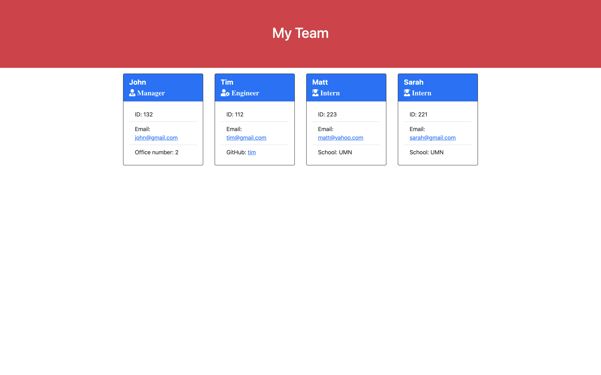

# Team-Profile-Generator

  
  
  

  ## Description 
  A command-line application that takes in information about employees on a software engineering team, then generates an HTML webpage that displays summaries for each person.

  

  ## Table of Contents
  
  * [Installation](#installation)
  * [Usage](#usage)
  * [License](#license) 
  * [Contributing](#contributing)
  * [Tests](#tests)
  * [Questions](#questions) 
  
  ## Installation
  1. Clone or download the repository
  1. Open console
  1. Run `npm install` to install dependencies
  
  ## Usage 
  1. Write `node index.js` in console to start the application
  1. The user is prompted to answer several questions to generate a web page with the team information
  1. After answering all the questions, the web page should appear in the ./dist folder

Please refer to this [video](https://drive.google.com/file/d/15hGdw_kECNA5508Q-kL4Vk8Fhz1oJdiE/view) for an in-depth functionality of the application
  
  
## License
  
This application is covered under MIT License [More information about about the license](https://choosealicense.com/licenses/mit/)
  
  ## Contributing
  Please feel free to contribute by sending a pull request
  
  ## Tests
  Run `npm run test` in the console

  ## Questions
  Please feel free to reach out with any questions via [email](mailto:samersaemeldahr@gmail.com) or [GitHub](https://www.github.com/samersaemeldahr)
